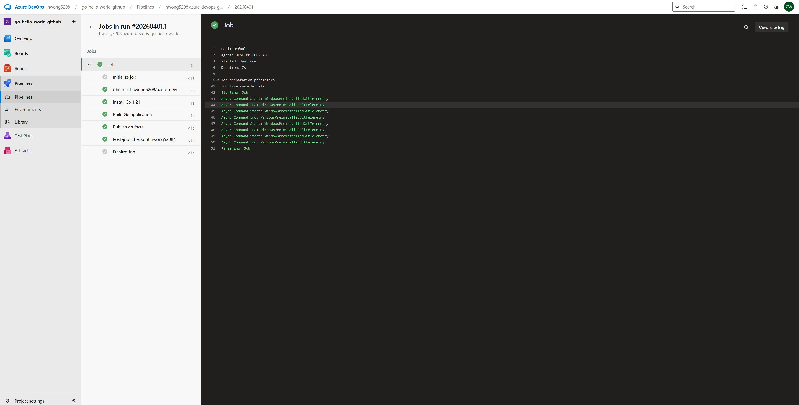

# Go Hello World - Azure DevOps CI/CD Portfolio

A production-ready demonstration of **Azure DevOps YAML pipeline orchestration** with **Golang** build automation. This project showcases hands-on expertise with self-hosted agents, automated workflows, and cloud-native CI/CD practices.

**Purpose**: Built to demonstrate core competencies for DevOps roles requiring Azure DevOps, Golang, and cloud-native infrastructure skills.

---

## Key DevOps Competencies Demonstrated

### Azure DevOps & YAML Pipeline Development
- **Self-Hosted Agent**: Pipeline configured to run on a local/private `default` agent pool (not cloud-hosted)
  - Demonstrates understanding of on-premises infrastructure integration with Azure DevOps
  - Shows capability to manage and troubleshoot self-hosted agent connectivity and performance
- **YAML-Based Pipeline**: Declarative CI/CD configuration in `azure-pipelines.yml`
  - Version-controlled pipeline-as-code approach
  - Trigger automation on `master` branch commits
  - Sequential task orchestration with proper error handling

### Golang Development & Build Automation
- **Go 1.21** toolchain integration with explicit version pinning
- **Executable Build**: Cross-platform compilation (`go build -o hello.exe`)
- **Artifact Publishing**: Automated artifact staging and Azure DevOps artifact repository integration
- **Real-world pattern**: Demonstrates build process suitable for containerized and distributed deployments

### CI/CD Pipeline Architecture
The pipeline implements **three core stages**:

```
[Code Commit to Master]
         ↓
[Install Go Toolchain]
         ↓
[Compile Golang Application]
         ↓
[Publish Build Artifacts]
         ↓
[Ready for Deployment]
```

---

## Pipeline Configuration

### Self-Hosted Agent Setup
```yaml
pool:
  name: 'default'
```
**Why it matters**:
- Builds run on local agent pool instead of cloud-hosted infrastructure
- Demonstrates agent pool configuration and management in Azure DevOps
- Shows integration between local systems and Azure DevOps service

### Automated Build Workflow
```yaml
steps:
  - task: GoTool@0
    inputs:
      version: '1.21'
    displayName: 'Install Go 1.21'

  - script: |
      go version
      go build -o hello.exe
    displayName: 'Build Go application'

  - task: PublishBuildArtifacts@1
    inputs:
      pathToPublish: '$(Build.ArtifactStagingDirectory)'
      artifactName: 'go-hello-world'
    displayName: 'Publish artifacts'
```

**Pipeline Features**:
- Explicit Go version management (1.21)
- Build output verification (`go version`)
- Artifact staging and publishing for downstream jobs
- Clear display names for pipeline visibility

---

---

## What This Project Demonstrates

| Skill | Evidence |
|---|---|
| **Azure DevOps YAML Pipeline** | `azure-pipelines.yml` with trigger automation and sequential task execution |
| **Golang Development** | `main.go` and `go.mod` with Go 1.21 build integration |
| **Self-Hosted Agent Pool** | `pool: 'default'` configuration managing builds on local infrastructure |
| **Build Automation** | Automated Go compilation with version verification |
| **Artifact Publishing** | Build output published to Azure DevOps artifact repository |
| **CI/CD Workflow** | Automated trigger on code commits, build execution, artifact staging |

---

## Pipeline Execution Proof



**Pipeline Status**: Successfully executed on self-hosted agent with all stages completed:
- Go toolchain installed (1.21)
- Application compiled to executable
- Build artifacts published to Azure DevOps repository

---

## Quick Start

### Prerequisites
- **Azure DevOps Project** with Git repository
- **Self-Hosted Agent** configured and running in your agent pool
- **Go 1.21** installed (agent will install automatically)

### Run Locally
```bash
# Clone the repository
git clone https://github.com/hwong5208/Azure_devop_go_Helloword_github.git
cd Azure_devop_go_Helloword_github

# Build locally
go build -o hello.exe

# Run the application
./hello.exe
```

### Trigger Pipeline in Azure DevOps
1. Push code to `master` branch
2. Monitor pipeline execution in **Azure DevOps > Pipelines > Jobs**
3. Verify build artifacts in **Azure DevOps > Artifacts**

---

## Author

**Tech Stack**: Azure DevOps, Golang 1.21, YAML, Self-Hosted Agents, Artifact Management, Claude code
